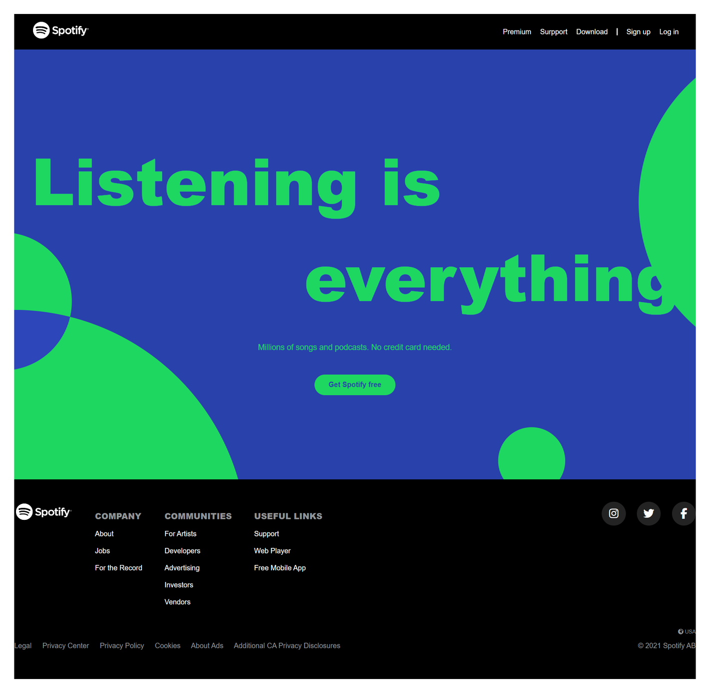
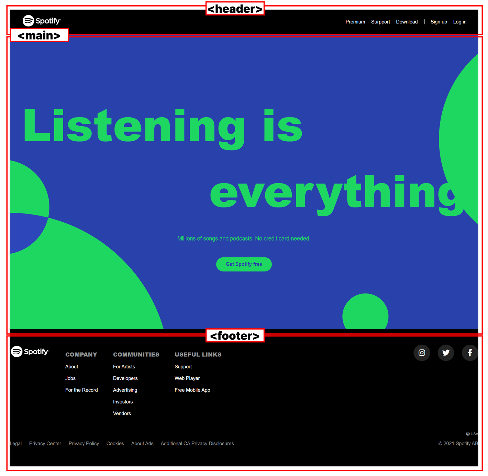
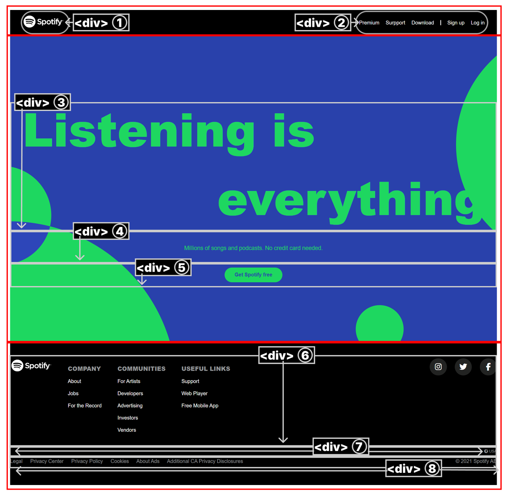

# 230113-230114 Spotify 클론 코딩


## 1. CSS 구조 파악



## 2. CSS 구조 정하기



## 3. 완료 모습




---

### 미디어 쿼리를 이용한 모바일 사이즈 시 깨짐 수정

- 초기 구현은
  [Replit](https://832a1242-7671-4884-b440-953d3ffddc3d-00-zesjd9c8otxa.pike.repl.co/) 또는
  [Notion](https://teal-catcher-309.notion.site/230113-230114-Spotify-1a9420e4cd39472085d2de9721e8877b) 참조

```css
@media (max-width: 768px) {
	header .nav a,
	header .nav span {
		display: none;
	}

	header #mobile-btn + .mobile-icon {
		display: block;
	}

	main .content h2 {
		font-size: 4.5em;
	}

	main .mobile-btn:hover .mobile-nav {
		display: block;
	}

	footer .section-menu {
		flex-direction: column;
		align-items: center;
		/* justify-content: center; */
	}

	footer .section-menu .menu-area {
		flex-direction: column;
		justify-content: center;
		align-items: center;
		gap: 0.8em;
	}

	footer .section-menu .menu-area .flex-column {
		justify-content: center;
		align-items: center;
		text-align: center;
	}

	footer .section-menu .menu-area .flex-column li h3 {
		color: #fff;
		cursor: pointer;
	}

	footer .section-menu .menu-area .flex-column li h3::after {
		display: inline-block;
		width: 15px;
		height: 15px;
		line-height: 0.8em;
		border-radius: 100%;
		text-align: center;
		content: '+';
		margin-left: 0.5em;
		border: 1px solid #fff;
		padding: 0.5em;
	}

	footer .section-menu .menu-area .flex-column li h3:hover {
		color: #1ed760;
	}

	footer .section-menu .menu-area .flex-column li:hover h3::after {
		border-color: #1ed760;
	}

	footer .section-privacy .privacy-area {
		margin-bottom: 2em;
	}
}

@media (max-width: 576px) {
	main .content h2 {
		font-size: 4em;
	}

	footer .section-menu .menu-area .flex-column li h3 {
		color: #fff;
		cursor: pointer;
		font-size: 1em;
	}

	footer .section-menu .menu-area .flex-column li h3::after {
		width: 10px;
		height: 10px;
		line-height: 0.8em;
	}

	footer .section-menu .menu-area .flex-column li a {
		display: none;
	}

	footer .section-usa {
		text-align: center;
	}

	footer .section-privacy p {
		text-align: center;
	}

	footer .section-privacy .privacy-area {
		display: none;
	}

	footer .section-privacy p {
		font-size: 0.9em;
	}
}

@media (max-width: 472px) {
	main .content h2 {
		font-size: 3em;
	}

	main .text {
		font-size: 1em;
	}

	footer .section-menu .menu-area .flex-column li h3 {
		color: #fff;
		cursor: pointer;
		font-size: 0.8em;
	}
}

@media (max-width: 356px) {
	main .content h2 {
		font-size: 2.5em;
	}

	main .button-area button {
		font-size: 0.8em;
	}
}
```

### Google Fonts

가장 유사한 웹 폰트로 대체

```html
<!-- FONT -->
<link rel="preconnect" href="https://fonts.googleapis.com" />
<link rel="preconnect" href="https://fonts.gstatic.com" crossorigin />
<link
	href="https://fonts.googleapis.com/css2?family=Noto+Sans+KR:wght@100;300;700&display=swap"
	rel="stylesheet"
/>
<link
	rel="stylesheet"
	href="https://fonts.googleapis.com/css2?family=Material+Symbols+Outlined:opsz,wght,FILL,GRAD@20..48,100..700,0..1,-50..200"
/>
```

### Favicon

스포티파이 제공 favicon 사용

```html
<!-- FAVICON -->
<link rel="icon" href="https://open.spotifycdn.com/cdn/images/favicon32.b64ecc03.png" />
```

### Icon

무난한 [Font Awsome](https://fontawesome.com/) 사용
